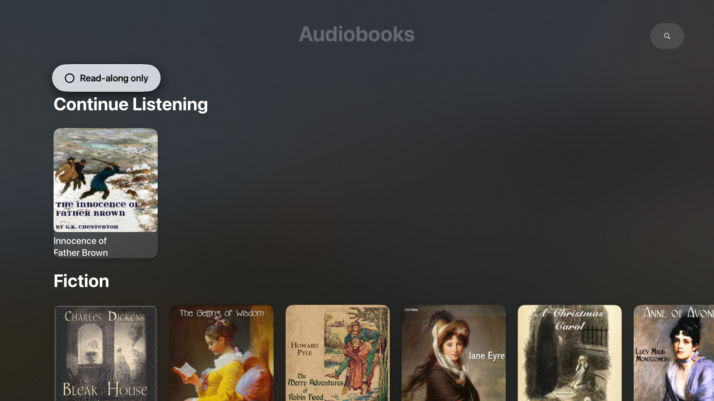
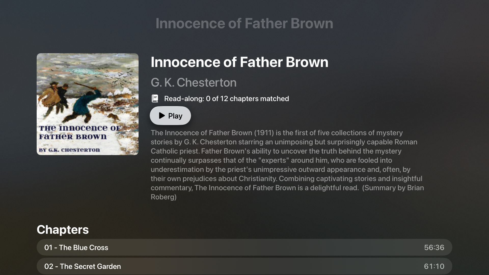

# AudiobooksTV — Read-Along Audiobooks for Apple TV

A SwiftUI Apple TV app that plays free public-domain audiobooks from
[LibriVox](https://librivox.org) while showing the matching book text from
[Project Gutenberg](https://www.gutenberg.org) on screen — listen and read
along, chapter by chapter.

Derived from [bible-appletv](https://github.com/jonyen/bible-appletv).





## Features

- **Browse** curated genre shelves (Fiction, Mystery, Sci-Fi, Children's,
  History, Adventure, Poetry) or search ~45,000 titles by title/author
- **Read along**: chapter text on screen while the narration plays, with
  play/pause, 0.75×–1.5× speed, and auto-advance to the next chapter
- **Text-availability at a glance**: dimmed titles are audio-only; a
  "Read-along only" toggle filters them out
- **Continue Listening**: playback position is saved per book and resumable
  from the home screen
- Recently played chapters and book texts are cached on-device

## How text matching works

LibriVox book records link to their Project Gutenberg source text. The app
downloads the plain text, strips the Gutenberg license boilerplate, splits it
into chapters by heading detection, and aligns audio sections to text
chapters by normalized title matching (Roman numerals → Arabic, punctuation
stripped), with positional fallback. The detail screen reports how many
chapters matched. Unmatched chapters fall back to a whole-book text scroll;
books with no Gutenberg source play audio-only.

## Setup

No API keys. Open `AudiobooksTV.xcodeproj` in Xcode 16 or later, select the
*AudiobooksTV* scheme and an Apple TV simulator (or device), and run.

Run the logic tests with `swift test` (macOS, no simulator needed).

## Web version

`web/` contains a React + Vite web port with the same read-along player and
progress synced through Google sign-in + Firestore. See `web/README.md`
for setup and deployment (Cloudflare Pages + Pages Functions).

## Project layout

```
AudiobooksTV/
├── AudiobooksTVApp.swift       App entry point
├── Core/                       Pure logic — also built as an SPM target for tests
│   ├── Audiobook.swift         Audiobook + AudioSection models
│   ├── LibriVoxParser.swift    LibriVox JSON → models
│   ├── GutenbergText.swift     Ebook ID extraction, boilerplate stripping
│   ├── ChapterSplitter.swift   Plain text → chapters
│   ├── SectionAligner.swift    Audio sections ↔ text chapters
│   ├── RomanNumerals.swift     Roman numeral parsing
│   ├── ProgressStore.swift     Saved playback positions
│   └── Shelf.swift             Home-screen genre shelves
├── Services/
│   ├── LibriVoxClient.swift    Catalog API + MP3 download/cache
│   ├── GutenbergClient.swift   Text download/cache
│   ├── BookTextModel.swift     Fetch → split → align orchestration
│   └── AudioPlayerModel.swift  AVPlayer wrapper
└── Views/
    ├── HomeView.swift          Shelves + Continue Listening
    ├── SearchView.swift        Title/author search
    ├── BookDetailView.swift    Book info, chapters, match summary
    ├── PlayerView.swift        Read-along player
    ├── ShelfRowView.swift      Horizontal book row
    └── BookCardView.swift      Cover card with text-availability tint
```

## Content licensing

All audio (LibriVox) and text (Project Gutenberg) is in the public domain.
